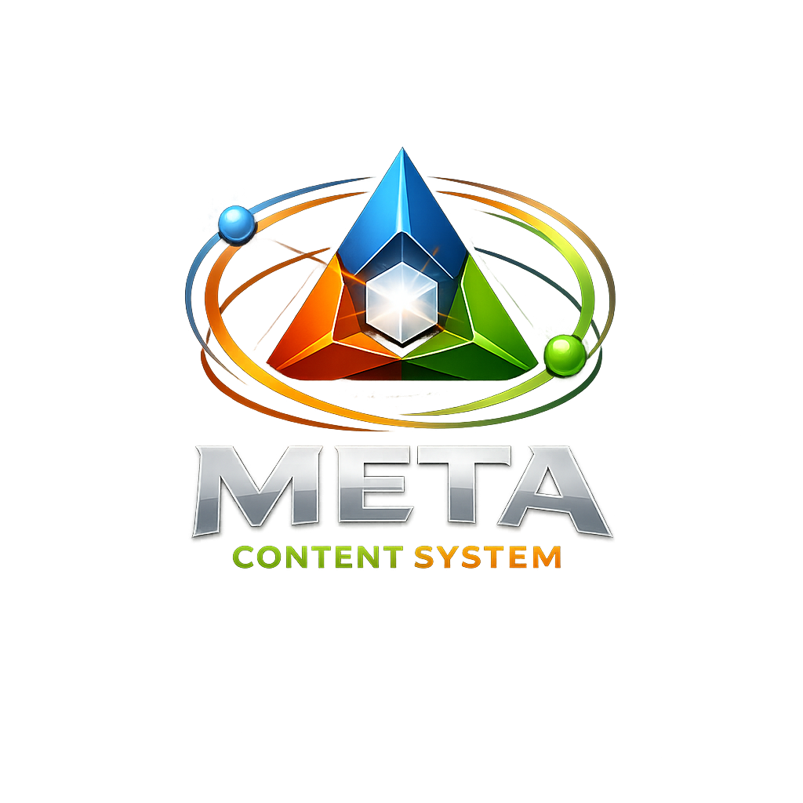

<p align="center">
  <a href="README.ja.md">日本語</a> | <a href="README.zh.md">中文</a> | <a href="README.es.md">Español</a> | <a href="README.fr.md">Français</a> | <a href="README.hi.md">हिन्दी</a> | <a href="README.it.md">Italiano</a> | <a href="README.pt-BR.md">Português (BR)</a>
</p>

<p align="center"></p>

<p align="center">
  <a href="https://github.com/mcp-tool-shop-org/meta-content-system/actions/workflows/build.yml"></a>
  
  <a href="https://www.nuget.org/packages/DevOpTyper.Content"></a>
  <a href="LICENSE"></a>
  <a href="https://mcp-tool-shop-org.github.io/meta-content-system/"></a>
</p>

**Shared content system for typing-practice apps -- lessons, progression, and adaptive difficulty.**

Meta Content System is the portable content pipeline behind [Dev-Op-Typer](https://github.com/mcp-tool-shop-org/dev-op-typer) (Windows) and [linux-dev-typer](https://github.com/mcp-tool-shop-org/linux-dev-typer) (cross-platform). It ingests source code files, normalizes them deterministically, computes difficulty metrics, and produces an indexed library that both apps consume identically regardless of platform.

## Why Meta Content System?

- **One pipeline, every platform** -- The same input files produce the same `library.index.json` on Windows, Linux, and macOS. No platform drift.
- **Zero external dependencies** -- Pure .NET 8 library built entirely on the BCL. Nothing to install, nothing to conflict.
- **Interface-driven architecture** -- Every pipeline stage (`IContentSource`, `IExtractor`, `IMetricCalculator`, `IContentLibrary`) is behind an abstraction for testability and extensibility.
- **Deterministic language detection** -- Rule-based identification from file extensions and content heuristics. Supports 20+ languages out of the box.
- **SHA-256 content deduplication** -- Content-addressed IDs prevent duplicates across imports. Import the same file twice, get one entry.
- **Difficulty-aware metrics** -- Symbol density, indent depth, line count, and character distribution power adaptive difficulty in consuming apps.
- **Smart extraction** -- Large files are split into right-sized practice blocks; small files are kept whole. Configurable thresholds.

## NuGet Package

| Package | Description |
|---------|-------------|
| [`DevOpTyper.Content`](https://www.nuget.org/packages/DevOpTyper.Content) | Content ingestion, normalization, language detection, metrics calculation, and index generation. Zero external dependencies. |

```bash
dotnet add package DevOpTyper.Content
```

## Quick Start

### As a library

```csharp
using DevOpTyper.Content.Abstractions;
using DevOpTyper.Content.Models;
using DevOpTyper.Content.Services;

// 1. Create the pipeline components
IExtractor extractor = new DefaultExtractor();
IMetricCalculator metrics = new MetricCalculator();
var builder = new LibraryIndexBuilder(extractor, metrics);

// 2. Build an index from a content source
IContentSource source = new MyFolderSource("./samples");
LibraryIndex index = await builder.BuildAsync(source);

// 3. Query the library
var library = new InMemoryContentLibrary(index.Items);
var pythonSnippets = library.Query(new ContentQuery
{
    Language = "python",
    MinLines = 5,
    MaxSymbolDensity = 0.4f
});

// 4. Persist the index
var store = new JsonLibraryIndexStore();
store.Save("library.index.json", index);
```

### Using the CLI

```bash
dotnet run --project src/DevOpTyper.Content.Cli -- build --source ./my-code --out library.index.json

dotnet run --project src/DevOpTyper.Content.Cli -- paste --lang csharp --title "Hello World" --text "Console.WriteLine(\"Hello\");"
```

## Architecture

```
IContentSource                    Enumerates raw files
       |
       v
LanguageDetector                  Extension map + content heuristics
       |
       v
IExtractor                        Split large files into practice blocks
       |
       v
Normalizer                        Line endings -> LF, trailing newline
       |
       v
ContentId                         SHA-256(language + normalized code)
       |                          First 16 bytes -> 32-char hex ID
       v
IMetricCalculator                 Lines, characters, symbol density,
       |                          max indent depth
       v
LibraryIndexBuilder               Deduplicates, sorts, emits index
       |
       v
ILibraryIndexStore                Serialize/deserialize library.index.json
       |
       v
IContentLibrary                   Query by language, source, line count,
                                  symbol density range
```

### Supported Languages

The language detector covers 20+ languages via extension mapping and content heuristics:

Python, C#, Java, JavaScript, TypeScript, SQL, Bash, Rust, Go, Kotlin, C, C++, JSON, YAML, Markdown -- and more via extension map. Unknown files fall back to `text`.

### Metrics Computed

| Metric | Type | Description |
|--------|------|-------------|
| `Lines` | `int` | Total line count |
| `Characters` | `int` | Total character count including whitespace |
| `SymbolDensity` | `float` | Ratio of symbol characters to non-whitespace characters (0.0--1.0) |
| `MaxIndentDepth` | `int` | Deepest indentation level (4-space tabs) |

These metrics power adaptive difficulty: a snippet with high symbol density and deep nesting is harder to type than flat prose.

## Prerequisites

- [.NET 8 SDK](https://dotnet.microsoft.com/download/dotnet/8.0) or later

No other tools or dependencies are required.

## Building from Source

```bash
git clone https://github.com/mcp-tool-shop-org/meta-content-system.git
cd meta-content-system
dotnet restore
dotnet build -c Release
dotnet test -c Release
```

## Project Structure

```
meta-content-system/
├── src/
│   ├── DevOpTyper.Content/            # Core library (NuGet package)
│   │   ├── Abstractions/              # IContentLibrary, IContentSource,
│   │   │                              #   IExtractor, IMetricCalculator, ILibraryIndexStore
│   │   ├── Models/                    # CodeItem, CodeMetrics, LibraryIndex
│   │   └── Services/                  # LanguageDetector, Normalizer, ContentId,
│   │                                  #   MetricCalculator, LibraryIndexBuilder,
│   │                                  #   InMemoryContentLibrary, JsonLibraryIndexStore
│   └── DevOpTyper.Content.Cli/        # CLI tool for batch indexing
├── tests/
│   └── DevOpTyper.Content.Tests/      # xUnit tests (normalization, metrics, detection,
│                                      #   extraction, indexing, golden parity, store)
├── docs/                              # Design documents (extraction, detection, metrics)
├── spec/                              # JSON schemas (codeitem, libraryindex)
├── DevOpTyper.Content.sln
├── logo.png
└── LICENSE
```

## Design Goals

| Goal | How |
|------|-----|
| **Platform-stable output** | LF normalization, deterministic sort, content-addressed IDs |
| **Zero external dependencies** | Pure .NET 8 BCL -- no third-party NuGet packages |
| **Interface-driven** | Every pipeline stage is behind an abstraction |
| **Testable** | xUnit test suite with golden-parity checks |
| **Extensible** | Implement `IContentSource` for custom ingestion, `IExtractor` for custom splitting |

## Consuming Apps

| App | Platform | Repository |
|-----|----------|------------|
| Dev-Op-Typer | Windows (WinUI 3) | [mcp-tool-shop-org/dev-op-typer](https://github.com/mcp-tool-shop-org/dev-op-typer) |
| linux-dev-typer | Cross-platform (.NET) | [mcp-tool-shop-org/linux-dev-typer](https://github.com/mcp-tool-shop-org/linux-dev-typer) |

## License

[MIT](LICENSE)

---

<p align="center">
  Built by <a href="https://mcptoolshop.com">MCP Tool Shop</a>
</p>
